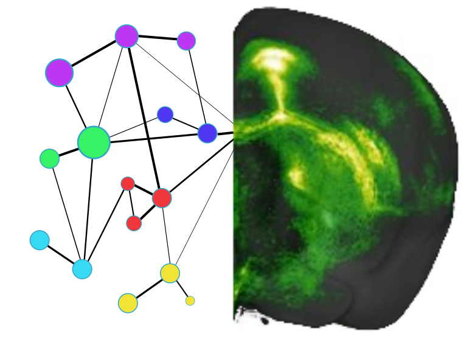

Documentation of mouse_connectivity_models |version|
====================================================
mouse_connectivity_models (`mcmodels <https://github.com/AllenInstitute/
mouse_connectivity_models.git>`_) is a Python package providing mesoscale
connectivity models for mouse using data from `anterograde viral tracing
experiments <http://connectivity.brain-map.org/>`_. This package was initially
written when developing the latest voxel-scale connectivity model for the
publication `'High resolution data-driven model of the mouse connectome'
<https://www.biorxiv.org/content/early/2018/04/01/293019>`_, and has since
become a repository for the various connectivity models we are researching.

Information for Researchers interested in the latest voxel-scale model
----------------------------------------------------------------------

.. currentmodule:: mcmodels.models.voxel

The latest voxel-scale model is a weighted, directed graph represented as an
adjacency matrix in which:

- rows : set of source voxels at 100 micron
- columns : set of target voxels at 100 micron
- elements : the nonnegative connection weight from a given source voxel to a
  given target voxel

This matrix has on the order of \~ 200,000 by 400,000 elements and most likely
will not in memory. However, our model learns a low-rank representation of this
adjacency matrix that we utilize to construct the full matrix in pieces on demand
through the :class:`VoxelConnectivityArray` class. For more
information see the :ref:`data_wrangling` section of the :ref:`user_guide`.

Regionalized voxel-scale model
~~~~~~~~~~~~~~~~~~~~~~~~~~~~~~

.. currentmodule:: mcmodels.core

Additionally, one may be interested in analysis of the model at a :term:`regional`
resolution. We have available a set of adjacency matrices of the connectivity
between a set of 293 :term:`summary_structures` for which we integrated our
voxel-scale connectivity. These can be conveniently downloaded (and subsequently
loaded from your local machine) through the :class:`VoxelModelCache` class, or
downloaded directly from `here <http://download.alleninstitute.org/publications/
A_high_resolution_data-driven_model_of_the_mouse_connectome/>`_.

Contents:
---------

.. toctree::
   :maxdepth: 1

   installation
   user_guide
   modules/classes
   auto_examples/index
   Glossary <glossary>
   Release history <whats_new>
   contributing
   Github Profile <https://github.com/AllenInstitute/mouse_connectivity_models.git>

Level of Support
----------------
We are not currently supporting this code, but simply releasing it to the
community AS IS but are not able to provide any guarantees of support. The
community is welcome to submit issues, but you should not expect an active
response.

.. include:: ../AUTHORS.rst
