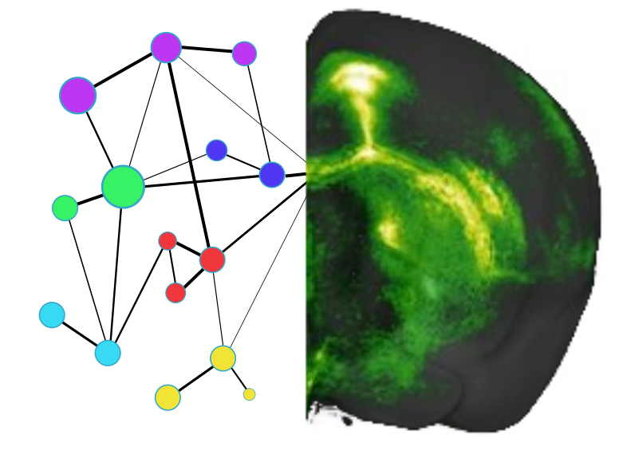

Documentation of mouse_connectivity_models |version|
======================================================
Briefly explain the purpose of this package.

Contents:
==================

.. toctree::
   :maxdepth: 1

   installation
   Glossary <glossary>
   user_guide
   history
   authors
   modules/classes
   auto_examples/index
   Github Profile <https://github.com/AllenInstitute/mouse_connectivity_models.git>

Indices and tables
==================

* :ref:`genindex`
* :ref:`modindex`
* :ref:`search`
